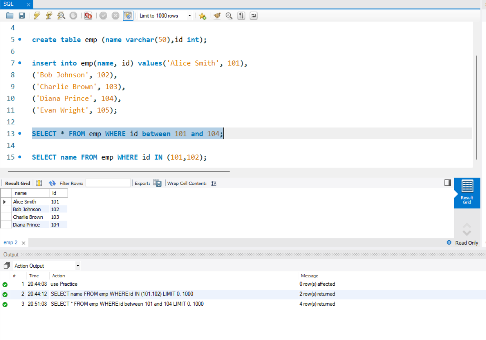
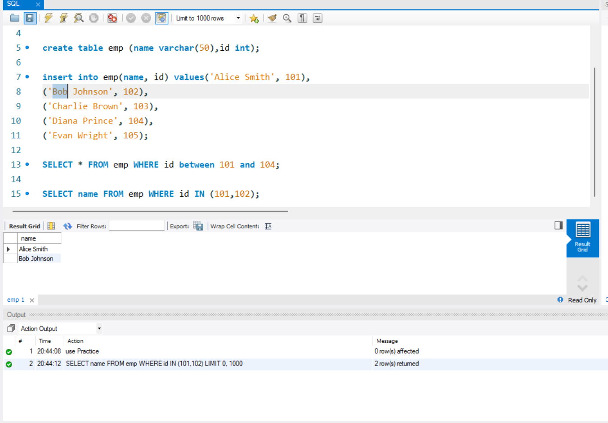

# JVM DAILY TASKS - (SQL)

## DAY 1

## **1. What is SQL?**
- SQL (Structured Query Language) is a relational database managment system language which gives us ability to define, manuplate, and control data

## **2. What is a database?**
- Collection of multiple tables is called database, database store tables which are relevant to each other

## **3. What is the difference between BETWEEN and IN operators in SQL**

- BETWEEN
    - BETWEEN is used as range
    - 

- IN
    - IN is used to acces contained values
    - 

## **4. What do you mean by data definition language?** 

- These are the commands in sql which are used to create, alter, rename, drop and trucate the database or table, these commandas are used to create structure and modify it.

## **5. What do you mean by data manipulation language?**

- These are the commands in sql which are used to  manuplate the table by inserting data, updating data, , deleting data.

## **6. What is the difference between primary key and unique constraints?** 

- Primary Key :
    - Primary Key is unique column that identifies the row(record)
    - each elemnet in column is unique

- Unique :
    - Each elemnt in qunique is common
    - it can contain null but null can not contain null

## **7. What is the view in SQL?**
- View does not store actual data on disk but instead it stores data logicaly

## **8. What do you mean by foreign key?**

- Foreign key is used to reference the other table by refrencing it towards prmary key of second tabl

## **9. What is normalization?**
- Normalization is the process of organizing data in a database to reduce data redundancy (duplication) and improve data integrity.

## **10. What is Denormalization?**

-Denormalization is the deliberate process of adding redundant data back into a previously normalized database